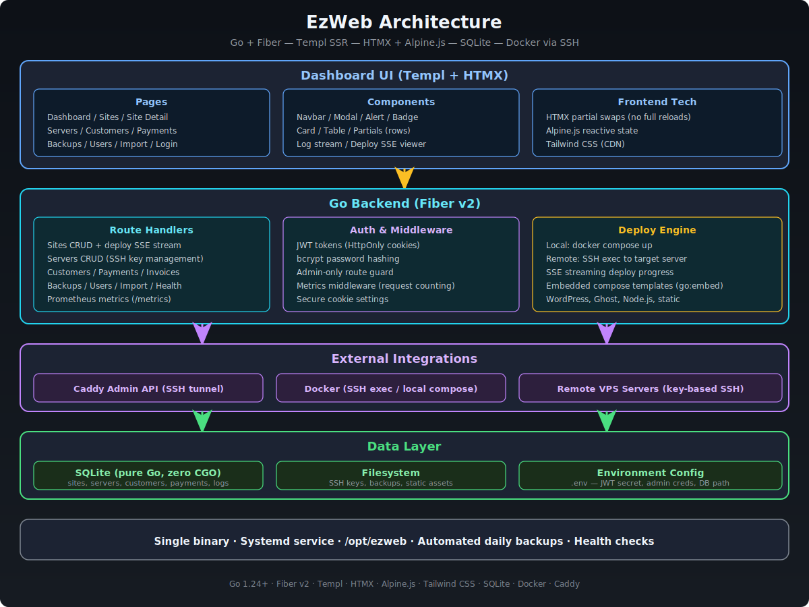

# EzWeb - Website Management Platform

A self-contained platform for managing client website contracts. Orchestrates Docker containers across multiple VPS machines via SSH, provides ready-to-go templates for popular site types, and tracks customers/payments.

## Features

- **Site Deployment** - Deploy WordPress, Ghost, Node.js, static sites, and more from built-in templates
- **Server Management** - Manage VPS machines via SSH with key-based authentication
- **Customer Tracking** - Full customer CRUD with company and contact info
- **Payment Tracking** - Invoice management with overdue detection and status color-coding
- **Health Monitoring** - Background health checks with HTTP and container status monitoring
- **Domain Management** - Caddy reverse proxy integration with auto-HTTPS
- **Site Logs** - View container logs directly from the dashboard

## Tech Stack

- **Backend:** Go + Fiber v2
- **Templating:** Templ (type-safe Go HTML)
- **Frontend:** HTMX + Alpine.js + Tailwind CSS (CDN)
- **Database:** SQLite (pure Go, no CGO)
- **Auth:** bcrypt + JWT (HttpOnly cookies)
- **Reverse Proxy:** Caddy (admin API)

## Quick Start

### Prerequisites

- Go 1.24+
- [templ](https://templ.guide/) CLI: `go install github.com/a-h/templ/cmd/templ@latest`

### Setup

```bash
# Clone and enter the project
git clone <repo-url> && cd EzWeb

# Copy environment config
cp .env.example .env

# Edit .env with your settings (change JWT_SECRET!)
nano .env

# Build and run
make run
```

The app starts on `http://localhost:3000`. Default login: `admin` / `admin123`.

### Environment Variables

**Core**

| Variable | Default | Description |
|---|---|---|
| `APP_PORT` | `3000` | HTTP listen port |
| `JWT_SECRET` | (required) | Secret key for JWT signing — min 32 chars |
| `JWT_EXPIRY_HOURS` | `24` | Session lifetime in hours |

**Admin Credentials**

| Variable | Default | Description |
|---|---|---|
| `ADMIN_USER` | `admin` | Admin username |
| `ADMIN_PASS` | (required) | Admin password — min 8 chars |

**Database**

| Variable | Default | Description |
|---|---|---|
| `DB_PATH` | `./ezweb.db` | SQLite database file path |
| `DB_MAX_OPEN_CONNS` | `25` | Max open database connections |
| `DB_MAX_IDLE_CONNS` | `5` | Max idle database connections |

**Caddy / Reverse Proxy**

| Variable | Default | Description |
|---|---|---|
| `CADDYFILE_PATH` | `/etc/caddy/Caddyfile` | Path to the managed Caddyfile |
| `ACME_EMAIL` | | Email for Let's Encrypt certificate registration |

**Security**

| Variable | Default | Description |
|---|---|---|
| `SECURE_COOKIES` | `false` | Set `true` in production (requires HTTPS) |
| `LOCKOUT_MAX_ATTEMPTS` | `5` | Failed login attempts before lockout |
| `LOCKOUT_DURATION_MIN` | `15` | Lockout duration in minutes |

**SSH**

| Variable | Default | Description |
|---|---|---|
| `SSH_KEY_DIR` | | Directory where SSH private keys are stored |

**Backups**

| Variable | Default | Description |
|---|---|---|
| `BACKUP_DIR` | `./backups` | Directory for site backup archives |

**Webhooks & Alerting**

| Variable | Default | Description |
|---|---|---|
| `WEBHOOK_URL` | | Webhook endpoint for notifications |
| `WEBHOOK_FORMAT` | `discord` | Webhook format — `discord` or `slack` |
| `ALERT_THRESHOLD` | `3` | Consecutive failures before an alert fires |
| `ALERT_EMAIL` | | Email address to receive alerts |

**SMTP**

| Variable | Default | Description |
|---|---|---|
| `SMTP_HOST` | | SMTP server hostname |
| `SMTP_PORT` | `587` | SMTP server port |
| `SMTP_FROM` | | Sender address for outgoing email |
| `SMTP_USERNAME` | | SMTP authentication username |
| `SMTP_PASSWORD` | | SMTP authentication password |

**Metrics & Health Checks**

| Variable | Default | Description |
|---|---|---|
| `METRICS_ENABLED` | `false` | Enable Prometheus-style metrics endpoint |
| `HEALTH_CHECK_INTERVAL` | `5` | How often to poll sites, in minutes |
| `HEALTH_RETENTION_DAYS` | `30` | Days to retain health check history |
| `ACTIVITY_RETENTION_DAYS` | `90` | Days to retain activity log entries |

**Domain Filtering**

| Variable | Default | Description |
|---|---|---|
| `PUBLIC_DOMAIN_FILTER` | | Optional suffix to filter public-facing domains |

## Build

```bash
# Development
make run

# Production binary (static, no CGO)
make prod-build

# The binary is fully self-contained - compose templates are embedded
./ezweb
```

## Site Templates

| Template | Description |
|---|---|
| WordPress | WordPress CMS + MySQL |
| WooCommerce | WordPress + WooCommerce + MySQL |
| Ghost | Ghost CMS + MySQL |
| Static | Nginx serving static files |
| Node.js | Node.js app container |
| Landing Page | Simple Nginx landing page |
| React SPA | Nginx serving a React SPA |

## License

This project is licensed under the [GNU General Public License v3.0](LICENSE).

## Architecture



### Design Decisions

- SSH exec over Docker TCP API for remote container management
- Compose templates embedded in the binary via `go:embed`
- Caddy admin API via SSH tunnel (never exposed publicly)
- Overdue payment detection computed at query time via SQL
- HTMX partial swaps for all mutations (no full page reloads)
- SSH keys stored on filesystem, DB stores path only
